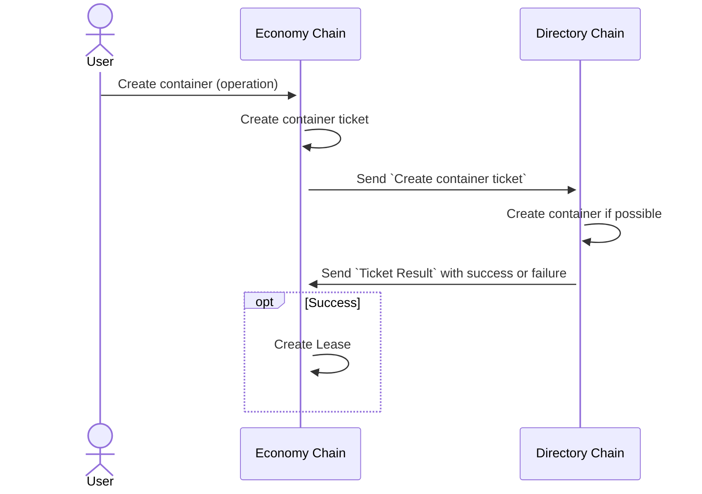

# Economy Chain

## Purpose

- Handle pricing logic
- Handle provider rewards
- Handle payment from dApps, through leases
- Request resources from Directory Chain

## Economy Chain API

- [Operations](./EC_Operations)
- [Queries](./EC_Queries)

## Ticket

Tickets are internally used between Economy Chain (EC) and Directory Chain (DC).

When a user, for example, requests a new container, it will go via EC that handles the payment of the container through
a lease. A container is requested from DC via a `Ticket`. When the container is set up in DC, the result is sent back
as a `Ticket Result` and on success a `Lease` is set up for the container in EC. If DC fails to create a container,
the payment is refunded.

From a DC perspective, a ticket is a command to allocate or reserve resources. It should be specific enough to
specify how much and what resources to allocate/reserve. DC receives tickets and sends results over ICMF.

## Container Lease

We call an association between a container and its owner a `Lease`. EC will handle all leases. A lease is done
on a weekly basis with a minimum of 1 week and a maximum of 12 weeks. A lease can be either prolonged manually or be
set up for auto-renewal. 

## Common reward pool

The container costs from leases are all kept in a common reward pool. This pool is then used when a provider shall be
paid a reward for supplying nodes to the network.

## Cost and Reward calculation

The cost for a lease is based on the information synced from DC, such as cluster type and container parameters. The
reward is calculated on nodes that are provided to the net by a provider.

<strong>Note: The exact formula for lease cost is not set yet!</strong>
### Factors

#### Node availability
Node availability measurement is based on the number of block periods which the node has signed at least one block in the cluster anchoring chain. The node period is defined by the number of nodes.

Node availability is a number between 0 and 1, where 1 represent no downtime during any of the block periods while 0 represent downtime during all block periods.

The `adjusted_availability_factor` is computed using formula:

`adjusted_availability_factor = max(0, availability_factor - 0.9) * 10`

#### Occupancy rate
Occupancy is calculated as SCUs being used/SCUs available. SCUs being used is defined as those assigned to Dapps and those assigned to system chains.

Occupancy rate ia a value between 0 and 1. Where 0 is no occupancy and 1 is full occupancy.

`container_units = lease @ { cluster, not .expired } ( @sum .container_units ) + standard_cluster_unit.system_container_units;`

`occupancy_rate = container_units / (cluster.cluster_units * standard_cluster_unit.container_units);`

#### Cluster value
`cluster_value = (cluster.cluster_units * standard_cluster_unit.container_units) * cluster.tag.scu_price + (cluster.extra_storage / 1024) * cluster.tag.extra_storage_price`

#### Node value
`node_value = cluster_value / cluster_nodes`

#### Cluster utilization 
`cluster_utilization = occupancy_rate * economy_constants.node_utilization_value_factor`

### System clusters reward
System cluster reward is calculated based on the `cluster_value` and the `cluster_utilization` of non-system clusters and `adjusted_availability_factor` of system cluster.

`cluster_utilization_value = cluster_utilization * cluster_value`

First, we sum a weighted average between `cluster_value` and `cluster_utilization_value ` with the weight factor `economy_constants.node_value_vs_utilization_weight` over all non-system clusters, and then adjust by `system_provider_reward_share` the total, and divide by number of system nodes.

`system_cluster_reward_per_node = (total * economy_constants.system_provider_reward_share) / cluster_nodes`

To get the `node_reward` adjust `system_cluster_reward_per_node` using the formula :

`node_reward = system_cluster_reward_per_node * adjusted_availability_factor * economy_constants.chr_per_usd * units_per_asset`

### Dapp clusters reward
Dapp clusters rewards are calculated based on the `node_value`, `cluster_utilization` and `adjusted_availability_factor` of dapp nodes.

`node_utilization_value = cluster_utilization * node_value`

First, we compute a weighted average between `cluster_value` and `node_utilization_value` with the weight factor `economy_constants.node_value_vs_utilization_weight` to get the `node_value_node_utilization_average`.

To get the `node_reward` adjust the `node_value_node_utilization_average` using the formula:

`node_reward = node_value_node_utilization_average * adjusted_availability_factor * economy_constants.provider_reward_share * economy_constants.chr_per_usd * units_per_asset`