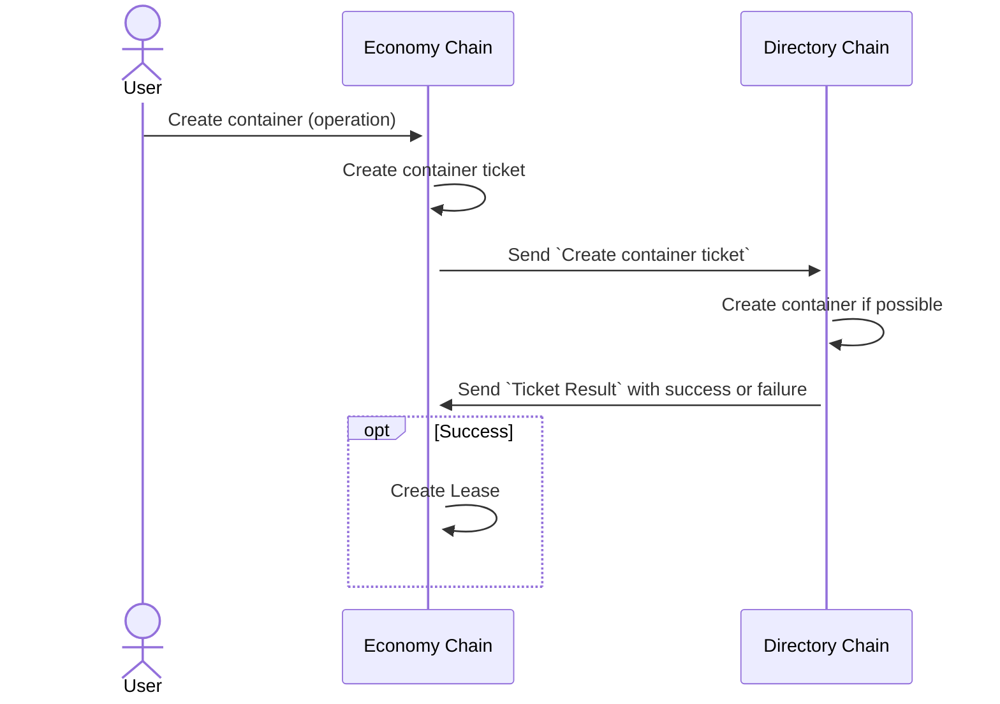

# Economy Chain

## Purpose

- Handle pricing logic
- Handle provider rewards
- Handle payment from dApps, through leases
- Request resources from Directory Chain

## Economy Chain API

- [Operations](./EC_Operations)
- [Queries](./EC_Queries)

## Ticket

Tickets are internally used between Economy Chain (EC) and Directory Chain (DC).

When a user, for example, requests a new container, it will go via EC that handles the payment of the container through
a lease. A container is requested from DC via a `Ticket`. When the container is set up in DC, the result is sent back
as a `Ticket Result` and on success a `Lease` is set up for the container in EC. If DC fails to create a container,
the payment is refunded.

From a DC perspective, a ticket is a command to allocate or reserve resources. It should be specific enough to
specify how much and what resources to allocate/reserve. DC receives tickets and sends results over ICMF.

## Container Lease

We call an association between a container and its owner a `Lease`. EC will handle all leases. A lease is done
on a weekly basis with a minimum of 1 week and a maximum of 12 weeks. A lease can be either prolonged manually or be
set up for auto-renewal. 

## Common reward pool

The container costs from leases are all kept in a common reward pool. This pool is then used when a provider shall be
paid a reward for supplying nodes to the network.

## Cost and Reward calculation

The cost for a lease is based on the information synced from DC, such as cluster type and container parameters. The
reward is calculated on nodes that are provided to the net by a provider.

<strong>Note: The exact formula for lease cost is not set yet!</strong>
### Factors

#### Node availability
Node availability measurement is based on the number of block periods which the node has signed at least one block in the cluster anchoring chain. The node period is defined by the number of nodes.

Node availability is a number between 0 and 1, where 1 represent no downtime during any of the block periods while 0 represent downtime during all block periods.

The `adjusted_availability_factor` is computed using formula:

`adjusted_availability_factor = max(0, availability_factor - 0.9) * 10`

#### Occupancy rate
Occupancy is calculated as SCUs being used/SCUs available. SCUs being used is defined as those assigned to Dapps.

Occupancy rate ia a value between 0 and 1. Where 0 is no occupancy and 1 is full occupancy.

`occupied_scus = lease @ { cluster, not .expired } ( @sum .container_units );`

`total_available_scus = cluster_units * standard_cluster_unit.container_units`

`occupancy_rate = occupied_scus / total_available_scus - standard_cluster_unit.system_container_units;`

#### Reduction
`Reduction = Chromia foundation fee share + Resource pool margin fee share + system provider fee share`

#### Dapp cluster value
`Dapp cluster value = (Total available number of SCUs in cluster - Total System chain SCUs in cluster) * Price per SCU + Total price per GB of extra storage * Total GB of extra storage)*(1-Reduction)/(1+Staking reward fee share)`

#### Total max revenue per dapp cluster (node value)
`Total max revenue per dapp cluster = (Total available number of SCUs in cluster - Total system chain SCUs in cluster) * Price per SCU + Total price per GB of extra storage * Total GB of extra storage`

#### System Provider Cost share per node
`System Provider Cost share per node = (Sum(Total max revenue per dapp cluster) * System provider fee share)/ Number of nodes in system cluster`

#### System provider reward per node
`System provider reward per node = Max(Total cost system providers* (1- system provider risk share) + System Provider Cost Share per node * System provider risk share, System Provider Cost Share)*Availability factor

### Dapp provider reward per node
`Dapp provider reward per node ((Dapp cluster value * (1 - Dapp provider risk share) + Dapp cluster value* Occupancy rate * Dapp Provider Risk Share)/Number of nodes per dapp cluster)*Availability factor`