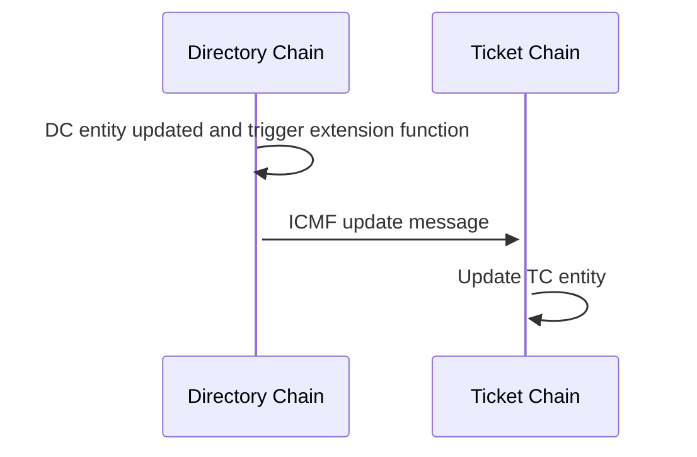

# Ticket Chain synchronization from Directory Chain

To be able to calculate the correct rewards in Ticket Chain (TC) information needs to be synchronized over from Directory Chain (DC) to TC.

The synchronization is done via extension functions in DC that are extended and then converted to ICMF messages that are sent to TC.
TC then receives the messages and updates the internal information that mirrors the information in DC. The information that is synced
over are `Providers`, `Nodes`, `Clusters` and the relationship between these.

