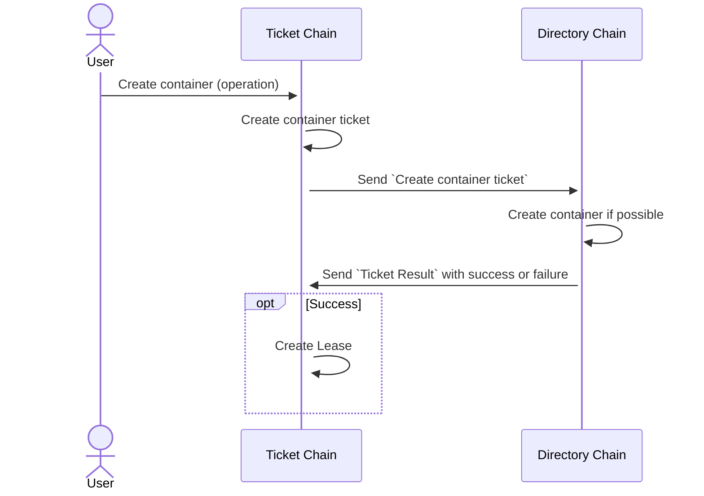

# Ticket Chain

## Purpose

- Handle pricing logic
- Handle provider rewards
- Handle payment from dApps, through leases
- Request resources from Directory Chain

## Ticket Chain API

- [Operations](./TC_Operations.md)
- [Queries](./TC_Queries.md)

## Ticket

Tickets are internally used between Ticket Chain (TC) and Directory Chain (DC). When a user, for example, requests a
new container, it will go via TC that handles the payment of the container through a lease. A container is requested
from DC via a `Ticket`. When the container is set up in DC, the result is sent back as a `Ticket Result` and on
success a `Lease` is set up for the container in TC. If DC fails to create a container, the payment is refunded.

From a DC perspective, a ticket is a command to allocate or reserve resources. It should be specific enough to
specify how much and what resources to allocate/reserve. DC receives tickets and sends results over ICMF.

## Container Lease

We call an association between a container and its owner a `Lease`. TC will handle all leases. A lease is done
on a weekly basis with a minimum of 1 week and a maximum of 12 weeks. A lease can be either prolonged manually or be
set up for auto-renewal. 

## Common reward pool

The container costs from leases are all kept in a common reward pool. This pool is then used when a provider shall be
paid a reward for supplying nodes to the network.

## Cost and Reward calculation

The cost for a lease is based on the information synced from DC, such as cluster type and container parameters. The
reward is calculated on nodes that are provided to the net by a provider.

<strong>Note: The exact formula for both lease cost and rewards is not set yet!</strong>